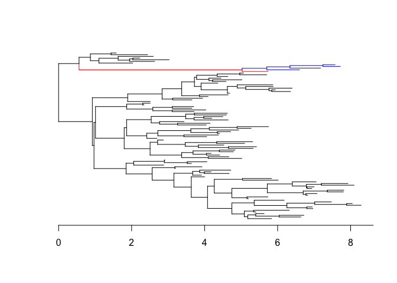

<!-- README.md is generated from README.Rmd. Please edit that file -->

# Introduction

`DetectImports` is a R package aimed at distinguishing imported cases
from locally acquired cases within a geographically limited genomic
sample of an infectious disease. The input is a dated phylogeny of local
genomes only, as can be build using `BEAST`, `treedater` or
`BactDating`. The main output is an estimated probability of importation
for each case in the dated phylogeny.

## Dependencies

`DetectImports` depends on [Stan](https://mc-stan.org/) through CmdStan.
Although [other options might
exist](https://mc-stan.org/docs/cmdstan-guide/cmdstan-installation.html),
for instance using Conda, the simplest option is to install CmdStan via
the R package [CmdStanR](https://mc-stan.org/cmdstanr/). You can do so
with the commands

``` r
install.packages("cmdstanr", repos = c("https://mc-stan.org/r-packages/", getOption("repos")))
library(cmdstanr)
install_cmdstan()
```

The last command will download and compile all the missing dependencies.

## Installation

You can install `DetectImports` directly from github with the commands:

``` r
devtools::install_github("xavierdidelot/DetectImports")
```

The package can then be loaded using:

``` r
library(DetectImports)
```

## Quick example

First we load and plot a dated tree stored in a Newick file. For this
example we will use the file `example.nwk` which is distributed within
the package `DetectImports`:

``` r
library(ape)
path=system.file("extdata", "example.nwk", package = "DetectImports")
tree=read.tree(path)
plot(tree,show.tip.label=F)
axisPhylo(1)
```

<!-- -->

We are now ready to detect the imports in this tree:

``` r
library(DetectImports)
set.seed(0) #For reproducibility
res=detectImports(tree)
plot(res)
```

<!-- -->

The plotting function for the results of `DetectImports` has a `type`
parameter which by default is set to `"scatter"`. So the last command
will produce a scatterplot of the coalescent intervals for each sequence
as a function of time, with the sequences corresponding to imports
coloured in red. By changing the `type` to `"tree"`, one will get a plot
of the original tree with, once again, imported sequences coloured in
red:

``` r
plot(res,type="tree")
```

<!-- -->

However, that is not all; sequences that have been propagating locally
but descend from originally imported sequences will also be coloured —
this time, in blue.

## Advanced examples

For more advanced examples of use, see the
[vignettes](https://github.com/xavierdidelot/DetectImports/tree/master/vignettes).
