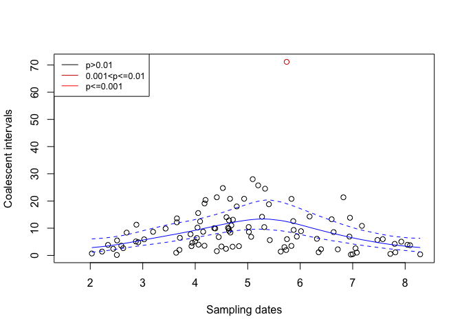
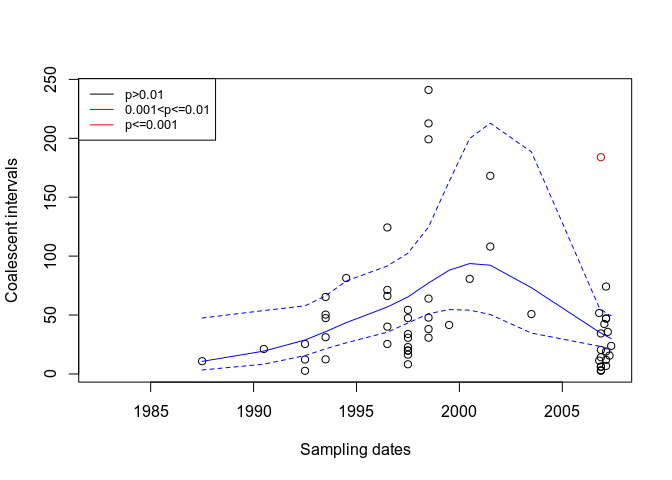

<!-- README.md is generated from README.Rmd. Please edit that file -->

# Introduction

`DetectImports` is a R package aimed at distinguishing imported cases
from locally acquired cases within a geographically limited genomic
sample of an infectious disease. The input is a dated phylogeny of local
genomes only, as can be build using `BEAST`, `treedater` or
`BactDating`. The main output is an estimated probability of importation
for each case in the dated phylogeny.

## Dependencies

`DetectImports` depends on [Stan](https://mc-stan.org/) through CmdStan.
Although [other options might
exist](https://mc-stan.org/docs/cmdstan-guide/cmdstan-installation.html),
for instance using Conda, the simplest option is to install CmdStan via
the R package [CmdStanR](https://mc-stan.org/cmdstanr/). You can do so
with the commands

``` r
install.packages("cmdstanr", repos = c("https://mc-stan.org/r-packages/", getOption("repos")))
library(cmdstanr)
install_cmdstan()
```

The last command will download and compile all the missing dependencies.

## Installation

You can install `DetectImports` directly from github with the commands:

``` r
library(devtools)
devtools::install_github("xavierdidelot/DetectImports")
```

The package can then be loaded using:

``` r
library(DetectImports)
```

## Quick examples

### Simulated tree

First we generate a random dated tree with imports, detect the latter
with `DetectImports`, and plot the results:

``` r
library(ape)
library(DetectImports)
set.seed(100)
sim_dated_tree=simImports(localPopStart=2020,importDates=c(2020.25),samplingStartDate=2020,samplingEndDate=2021,samplingNumber=500,globalNeg=0.01)
sim_results=detectImports(sim_dated_tree)
plot(sim_results)
```

<!-- -->

The plotting function for the results of `DetectImports` has a `type`
parameter which by default is set to `"scatter"`. So the last command
will produce a scatterplot of the number of coalescent intervals for
each sequence as a function of time, with the sequences corresponding to
imports coloured in red. By changing the `type` to `"tree"`, one will
get a plot of the original tree with, once again, imported sequences
coloured in red:

``` r
plot(sim_results,type="tree")
```

<!-- -->

However, that is not all; sequences that have been propagating locally
but descend from originally imported sequences will also be coloured —
this time, in blue.

### Tree from real data

For this more realistic example, we will start from the dataset `staph`
which is included in the package
[`BactDating`](https://github.com/xavierdidelot/BactDating) — please
visit the link for installation instructions. We won’t assume knowledge
of a dated tree as the one generated by the simulation in the previous
example, but rather *produce* a dated tree with `BactDating`. In order
to do so, we’ll need not only the tree for the sequences in `staph`,
which is contained in the field `staph$tree`, but also the dates at
which the sequences have been sampled. They are contained in the field
`staph$dates`:

``` r
library(BactDating)
staph$dates
#>  [1] 1998.500 1999.500 1998.500 1987.500 1994.500 1996.500 1982.500 2000.500
#>  [9] 1996.500 1996.500 1996.500 2006.875 2007.125 2006.875 2006.875 2006.875
#> [17] 2007.125 2007.208 2006.792 2006.875 2007.125 2006.875 2001.500 2006.875
#> [25] 2006.792 2007.042 2007.125 2006.875 2007.375 2007.292 2007.125 2007.125
#> [33] 1998.500 1998.500 1996.500 1993.500 1998.500 1997.500 1997.500 1997.500
#> [41] 1997.500 2001.500 1993.500 1997.500 1997.500 2003.500 1997.500 1997.500
#> [49] 1998.500 1997.500 1998.500 1990.500 1992.500 1992.500 1993.500 1993.500
#> [57] 1993.500 1992.500
```

Given tree and dates, we can then generate a dated tree with
`BactDating`:

``` r
staph_dated<-bactdate(staph$tree,staph$dates)
```

and then run `DetectImports` on it and plot results as before:

``` r
staph_results=detectImports(staph_dated$tree)
plot(staph_results)
```

<!-- -->

``` r
plot(staph_results,type="tree")
```

<!-- -->

### Advanced examples

For more advanced examples of use, see the
[vignettes](https://github.com/xavierdidelot/DetectImports/vignettes).
