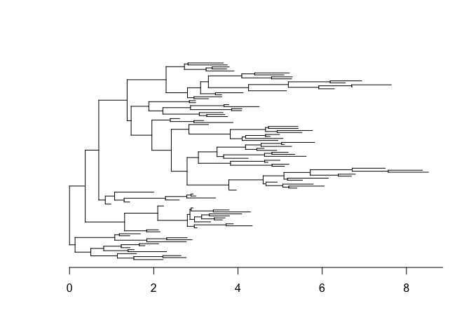

<!-- README.md is generated from README.Rmd. Please edit that file -->

# Introduction

`DetectImports` is a R package aimed at distinguishing imported cases
from locally acquired cases within a geographically limited genomic
sample of an infectious disease. The input is a dated phylogeny of local
genomes only, as can be build using `BEAST`, `treedater` or
`BactDating`. The main output is an estimated probability of importation
for each case in the dated phylogeny.

## Installation

You can install `DetectImports` directly from github with the command:

``` r
devtools::install_github("xavierdidelot/DetectImports")
```

The package can then be loaded using:

``` r
library(DetectImports)
```

## Quick example

First we generate a random tree with 100 leaves:

``` r
library(ape)
library(DetectImports)
set.seed(0)
tree=rtree(100)
plot(tree,show.tip.label=F)
axisPhylo(1,backward = F)
```

<!-- -->

Let us detect the imports in this tree:

``` r
r=detectImports(tree)
plot(r)
```

<!-- -->

Here we see that no import was detected. For more advanced examples of
use, see the vignettes.
